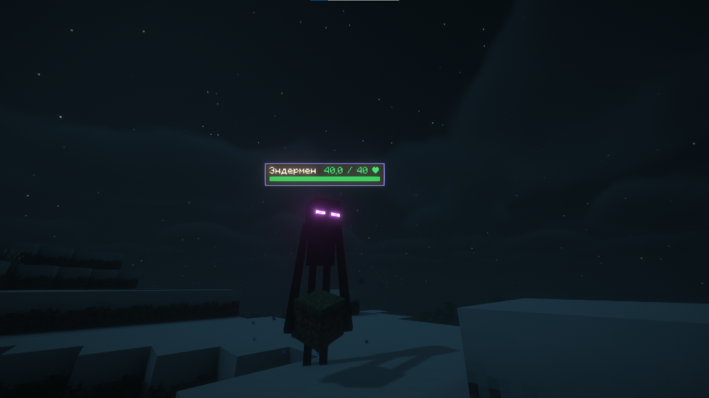
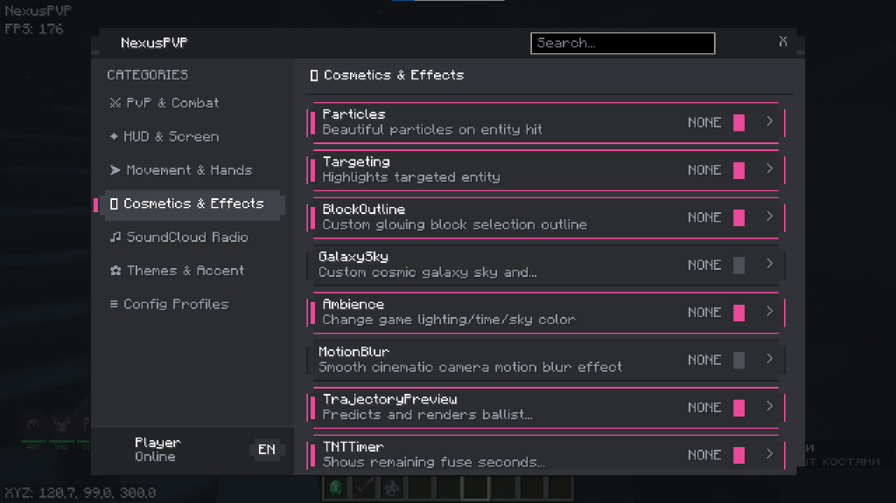
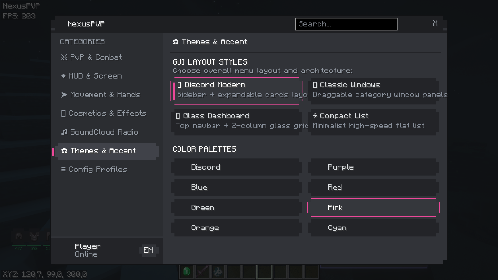
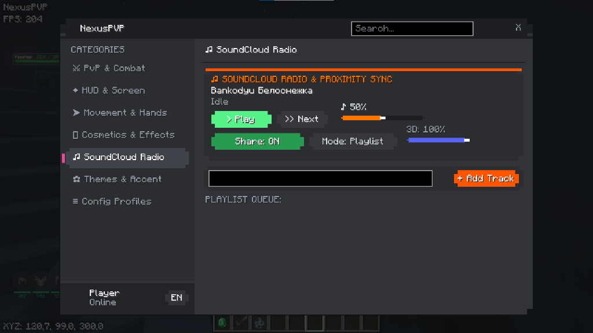

# 
⚔️ NexusPVP Client ⚔️

  <strong>The Ultimate Next-Gen PvP & Visual Client for Minecraft Fabric</strong>

  
  

  
  
  
  
  

  

  <strong><a href="#-русская-версия">🇷🇺 Перейти к русской версии</a></strong> • 
  <strong><a href="#-english-version">🇬🇧 Switch to English Version</a></strong>

---

# 🇷🇺 Русская версия

> [!IMPORTANT]
> **ОБЯЗАТЕЛЬНОЕ ТРЕБОВАНИЕ:** Для работы клиента **необходим [Fabric API](https://modrinth.com/mod/fabric-api)** соответствующей версии игры (`1.16.5`, `1.20.1` или `1.21.1`)! Без установленного Fabric API мод не запустится.

## 🌟 О проекте

**NexusPVP** — это инновационный, полностью кастомизируемый визуальный PvP-клиент для Minecraft на платформе **Fabric** (`1.16.5`, `1.20.1`, `1.21.1`). Клиент создан специально для динамичных PvP-битв, анархии (**HolyWorld, FunTime, ReallyWorld**) и комфортной игры с максимальным FPS.

---

## 📸 Скриншоты интерфейса

  
  

  
  

---

## 📋 Системные требования

| Компонент | Требуемая версия | Ссылка |
|---|---|---|
| ☕ **Java** | Java 8 (для 1.16.5) / Java 17 (для 1.20.1) / Java 21 (для 1.21.1) | [Adoptium Temurin](https://adoptium.net/) |
| 🧵 **Fabric Loader** | `0.14.0` или новее | [Fabric Installer](https://fabricmc.net/) |
| 🧩 **Fabric API (ОБЯЗАТЕЛЬНО)** | Подходящий под вашу версию игры | **[Скачать Fabric API](https://modrinth.com/mod/fabric-api)** |

---

## 🎨 4 Архитектурных стиля интерфейса (GUI Layouts)

Меню `NexusPVP` переключается на лету между **4 принципиально разными дизайнами**:

| Стиль | Описание | Особенности |
|---|---|---|
| 💬 **Discord Modern** | Боковой сайдбар с иконками категорий + карточки | Полные описания, бегунки, SoundCloud плеер |
| 🪟 **Classic Windows** | Независимые перетаскиваемые окна по категориям | Drag & Drop окон, сворачивание, компактные списки |
| 💎 **Glass Dashboard** | Верхний навбар + матовая 2-колоночная сетка | Эффект Frosted Glass, iOS-переключатели, модальные настройки |
| ⚡ **Compact List** | Ультра-компактный плоский список | Молниеносное переключение в бою, выездной слайдер настроек |

---

## 🔥 Ключевые возможности (36 модулей)

### ⚔️ PvP & Бой (Combat — 13 функций)
- 🎯 **TargetHUD**: Стильная карточка захваченной цели с 3D-моделью скина, здоровьем, броней и плавной шкалой HP.
- 🩸 **OverheadHealth**: Discord-карточка со здоровьем и поглощением ровно над головами мобов и игроков. Не видна сквозь стены, 0 искажений моделей.
- 💥 **DamageIndicator**: Всплывающие числа урона с параболической физикой и счетчик комбо-ударов (`HITS / DMG`).
- 🎯 **Crosshair & Hitmarker**: Кастомный прицел с динамическим разлетом от кулдауна удара и 45-градусным `X`-хитмаркером при попадании.
- 🏹 **TrajectoryPreview**: 3D-расчёт траектории и места приземления перлов (Ender Pearl), стрел, трезубцев и зелий.
- 🧨 **TNTTimer**: 3D-таймер над динамитом с индикатором опасной зоны взрыва.
- 🥊 **ViewModel & 1.7 Block-Hit**: Полная 3D-настройка рук и оружия + классическая анимация блока мечом.
- 🔔 **HitSounds с ComboPitch**: Настраиваемые звуки ударов с динамическим повышением тона при комбо.
- 🩸 **HitColor**: Вспышка цвета при попадании по сущности.
- 🪓 **TotemPop**: Счётчик сбитых тотемов бессмертия у противника.
- 🏃 **SmartSprint**: Автоматический бег и оптимизированный спринт.
- ⏳ **ItemCooldowns**: Числовые таймеры перезарядки эндер-перлов, золотых яблок и щитов.
- ⌨️ **CommandKeybinds**: Мгновенный ввод серверных команд по нажатию горячих клавиш.

### 🌌 Визуальные эффекты (Visual — 9 функций)
- 🌌 **GalaxySky**: Космическое звездное небо с градиентами.
- 🌊 **ClearWater**: Полное устранение мутного подводного тумана.
- 🔥 **LowFire**: Низкий огонь на экране, не закрывающий обзор.
- 🟩 **BlockOutline**: Неоновая подсветка и кастомный контур выделенного блока.
- ✨ **Particles**: Эффектные частицы и сердечки при нанесении ударов.
- ⭕ **Targeting**: Неоновый круг и подсветка цели под ногами.
- 🌊 **MotionBlur**: Кинематографичное размытие в движении.
- 💡 **Ambience**: Кастомное время суток, освещение и яркость (Fullbright).
- 🔍 **Zoom**: Плавное приближение камеры с зумом на колесико.

### 🖥️ HUD & Интерфейс (7 функций)
- 📊 **HudModule**: Watermark, список активных модулей (ArrayList), FPS, координаты.
- 🛡️ **ArmorHUD & LowDurabilityAlert**: Точная прочность брони (`480/528`) и предупреждение при критическом износе.
- 🧪 **PotionHUD с DurationBar**: Таймеры и цветные тающие полосы активных эффектов.
- ⌨️ **Keystrokes**: Отображение нажатий клавиш WASD, пробела и CPS.
- 📦 **ShulkerPreview (3x9)**: Мгновенный предпросмотр содержимого шалкеров при наведении.
- 🎯 **TrajectoryPreview**: 3D-траектория полета снарядов.
- 🧨 **TNTTimer**: Визуализация таймера и опасной зоны динамита.

### 👤 Персонаж & Чат (4 функции)
- 🥊 **ViewModel**: Тонкая настройка положения рук и оружия в пространстве.
- ⚔️ **SwingAnimations**: Плавные анимации взмаха меча, кручение, классический блок 1.7.
- 👶 **BabyMode**: Забавный режим уменьшения модельки игрока.
- 📜 **ChatTweaks**: Временные метки `[HH:mm:ss]` перед сообщениями в чате.

### 🛠️ Медиа & Утилиты (3 функции)
- 🎵 **SoundCloud Radio**: Встроенный музыкальный плеер прямо в меню игры с 3D-звуком.
- 🎨 **ClickGuiModule**: Модуль вызова меню (`Right Shift`) с переключением 4 стилей.
- 📋 **DebugLogger**: Внутриигровой монитор состояния клиента.

---

## 📥 Пошаговая установка

1. Скачайте и установите **[Fabric Loader](https://fabricmc.net/)** для вашей версии игры (`1.16.5`, `1.20.1` или `1.21.1`).
2. **ОБЯЗАТЕЛЬНО:** Скачайте **[Fabric API](https://modrinth.com/mod/fabric-api)** для вашей версии игры и поместите его в папку `.minecraft/mods`.
3. Скачайте `.jar` файл клиента нужной версии из раздела **[Releases](../../releases)**:
   - `NexusPVP-1.16.5-v0.1.33-beta.jar`
   - `NexusPVP-1.20.1-v0.1.33-beta.jar`
   - `NexusPVP-1.21.1-v0.1.33-beta.jar`
4. Поместите файл `NexusPVP-*.jar` в папку `.minecraft/mods`.
5. Запустите игру и нажмите **`Right Shift`** для открытия меню!

---

## ⌨️ Управление

* **`Right Shift`** — Открыть / закрыть меню настроек (`NexusPVP GUI`).
* **`ЛКМ`** — Включить / выключить модуль.
* **`ПКМ`** — Раскрыть подробные настройки модуля.
* **`СКМ` (Колёсико)** или кнопка **`[BIND]`** — Назначить горячую клавишу на модуль.

---
---

# 🇬🇧 English Version

> [!IMPORTANT]
> **MANDATORY REQUIREMENT:** This mod **strictly requires [Fabric API](https://modrinth.com/mod/fabric-api)** for your corresponding Minecraft version (`1.16.5`, `1.20.1`, or `1.21.1`)! The mod will not start without Fabric API installed.

## 🌟 About NexusPVP

**NexusPVP** is an advanced, fully customizable visual PvP client for Minecraft built on the **Fabric** platform supporting (`1.16.5`, `1.20.1`, `1.21.1`). Engineered specifically for competitive PvP, Anarchy servers, and crystal-clear high FPS performance.

---

## 📸 Interface Screenshots

  
  

  
  

---

## 📋 Requirements

| Dependency | Required Version | Link |
|---|---|---|
| ☕ **Java** | Java 8 (for 1.16.5) / Java 17 (for 1.20.1) / Java 21 (for 1.21.1) | [Adoptium Temurin](https://adoptium.net/) |
| 🧵 **Fabric Loader** | `0.14.0` or newer | [Fabric Installer](https://fabricmc.net/) |
| 🧩 **Fabric API (REQUIRED)** | Matching your Minecraft version | **[Download Fabric API](https://modrinth.com/mod/fabric-api)** |

---

## 🎨 4 Distinct GUI Layouts

Switch seamlessly between **4 uniquely designed GUI layouts** in real time:

| Layout | Description | Highlights |
|---|---|---|
| 💬 **Discord Modern** | Sidebar navigation with category icons + module cards | Full descriptions, smooth sliders, SoundCloud player |
| 🪟 **Classic Windows** | Draggable floating windows for each category | Window drag-and-drop, collapsible headers, compact cards |
| 💎 **Glass Dashboard** | Top navigation bar + frosted 2-column grid | Frosted glass look, iOS toggle switches, clean modal settings |
| ⚡ **Compact List** | Ultra-minimalist flat list | Fast mid-fight toggling, slide-out setting panels |

---

## 🔥 Features Overview (36 Modules)

### ⚔️ PvP & Combat (13 Modules)
- 🎯 **TargetHUD**: Modern target card featuring the opponent's 3D skin model, health, armor durability, and smooth health bar animations.
- 🩸 **OverheadHealth**: Discord-styled floating health card positioned cleanly above players and entities. Line-of-sight checked (never visible through walls).
- 💥 **DamageIndicator**: Floating damage popups with parabolic bounce physics and active combo hit counter (`HITS / DMG`).
- 🎯 **Crosshair & Hitmarker**: Fully custom crosshair with dynamic attack spread and crisp 45° diagonal `X` hitmarkers.
- 🏹 **TrajectoryPreview**: Real-time 3D physics trajectory & landing prediction for Ender Pearls, arrows, tridents, and potions.
- 🧨 **TNTTimer**: 3D countdown timer above primed TNT with blast radius danger indicator.
- 🥊 **ViewModel & 1.7 Block-Hit**: Complete 3D hand/item translation, rotation, scaling, and classic 1.7 sword block animation.
- 🔔 **HitSounds with ComboPitch**: Customizable hit sound effects with dynamic pitch shifting on successive combo hits.
- 🩸 **HitColor**: Custom flashing color overlay when entities take damage.
- 🪓 **TotemPop**: Opponent totem pop counter with custom HUD alerts.
- 🏃 **SmartSprint**: Automated sprint management and continuous sprinting.
- ⏳ **ItemCooldowns**: Numeric cooldown display for pearls, gapples, and shields.
- ⌨️ **CommandKeybinds**: Instant keybind execution for custom server commands.

### 🌌 Visual Effects (9 Modules)
- 🌌 **GalaxySky**: Custom deep-space starry sky renderer with smooth gradients.
- 🌊 **ClearWater**: Completely eliminates murky underwater fog for crystal-clear vision.
- 🔥 **LowFire**: Reduced first-person burning screen overlay.
- 🟩 **BlockOutline**: Glowing customizable selection box on targeted blocks.
- ✨ **Particles**: Extra hit particles and heart bursts on combat contact.
- ⭕ **Targeting**: Visual aura ring underneath the locked-on target.
- 🌊 **MotionBlur**: Cinematic camera motion blur shader.
- 💡 **Ambience**: Custom time-of-day, sky color, and gamma brightness (Fullbright).
- 🔍 **Zoom**: Smooth cinematic camera zoom with scroll wheel magnification.

### 🖥️ HUD & Screen (7 Modules)
- 📊 **HudModule**: Watermark, active ArrayList, FPS counter, and coordinates.
- 🛡️ **ArmorHUD & LowDurabilityAlert**: Accurate armor durability counters (`480/528`) and flashing alerts when gear is near breaking.
- 🧪 **PotionHUD with DurationBar**: Active potion effect timers with colored draining progress bars.
- ⌨️ **Keystrokes**: Real-time display of WASD, Space, and left/right CPS.
- 📦 **ShulkerPreview (3x9)**: Instant hover preview of shulker box contents without opening chests.
- 🎯 **TrajectoryPreview**: 3D projectile ballistic trajectory line.
- 🧨 **TNTTimer**: Dynamic countdown and blast radius wireframe.

### 👤 Player & Chat (4 Modules)
- 🥊 **ViewModel**: Full 3D main/offhand translation, rotation, and scaling.
- ⚔️ **SwingAnimations**: Smooth sword swing styles, spin animations, and 1.7 block-hit.
- 👶 **BabyMode**: Shrinks player model into a miniature version.
- 📜 **ChatTweaks**: Accurate timestamp prefixes `[HH:mm:ss]` in chat messages.

### 🛠️ Media & Utilities (3 Modules)
- 🎵 **SoundCloud Radio**: Integrated audio streamer built right into the client interface.
- 🎨 **ClickGuiModule**: Menu launcher (`Right Shift`) with real-time style switching.
- 📋 **DebugLogger**: In-game real-time diagnostics monitor.

---

## 📥 Installation

1. Download and install **[Fabric Loader](https://fabricmc.net/)** for your Minecraft version (`1.16.5`, `1.20.1`, or `1.21.1`).
2. **REQUIRED:** Download **[Fabric API](https://modrinth.com/mod/fabric-api)** matching your version and put it in your `.minecraft/mods` folder.
3. Download the matching `.jar` from **[Releases](../../releases)**:
   - `NexusPVP-1.16.5-v0.1.33-beta.jar`
   - `NexusPVP-1.20.1-v0.1.33-beta.jar`
   - `NexusPVP-1.21.1-v0.1.33-beta.jar`
4. Place `NexusPVP-*.jar` into your `.minecraft/mods` directory.
5. Launch Minecraft and press **`Right Shift`** to open the menu!

---

## ⌨️ Controls & Keybinds

* **`Right Shift`** — Open / Close the NexusPVP ClickGUI.
* **`Left Click`** — Toggle module on / off.
* **`Right Click`** — Expand detailed module settings.
* **`Middle Click` (Scroll wheel)** or **`[BIND]` button** — Assign a custom keybind.

---

## 📜 License
Distributed under the permissive **MIT License**. Contributions, suggestions, and pull requests are welcome! ⭐
